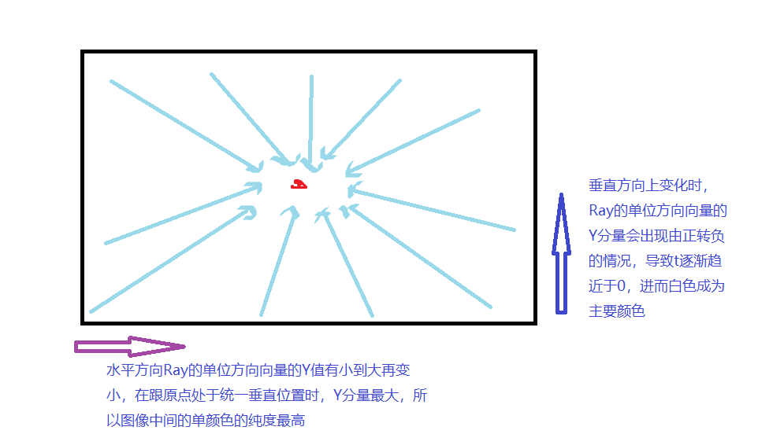
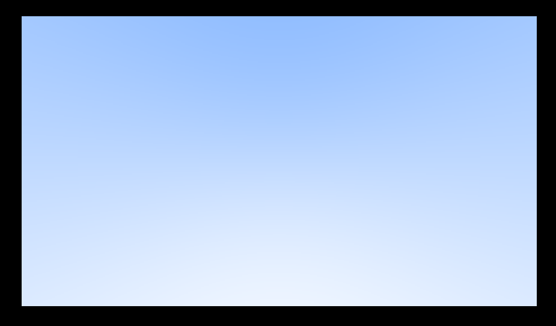
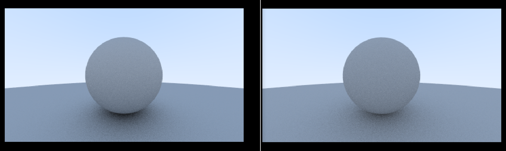
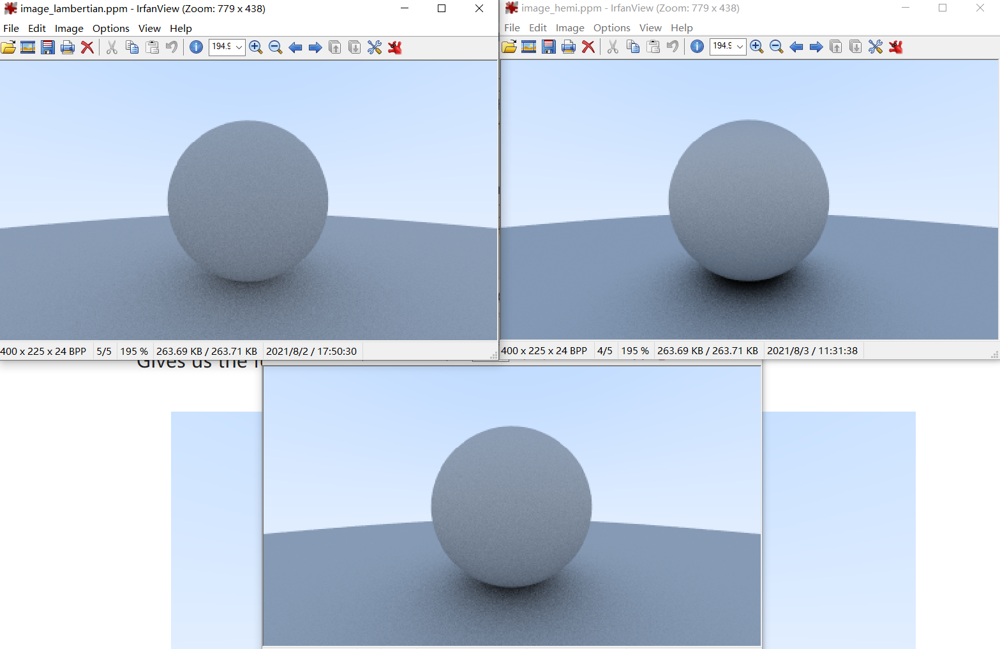

# RayTracingInOneWeekend

## 学习材料

https://raytracing.github.io/books/RayTracingInOneWeekend.html

## Timeline

### 2021-07-29

终于完成第一步，PPM格式的显示了...原来教程中输出的是`P3`格式，但是找了各种查看器(XnView, IrfanView...)都不支持`P3`格式了。自己重新改为了`P6`格式。终于完成第一步，图片输出与查看了！


> PPM格式：[PPM/PGM/PBM image files (paulbourke.net)](http://paulbourke.net/dataformats/ppm/)


基础结构了，可以开始学习理论了


2021-7-30

Ray的方向向量在遍历整个图像的过程中，呈现下面的变化（这里写的有问题...






2021-8-2

完成`Normals-Colored sphere with ground`显示。 这里地面之所以看起来都是绿色的，是因为球的半径很大，原点(0,  0, 0)发出的光线与球面相交的基本处于(0, -0.5, 0)这个zx平面附近，与圆心形成的法向量基本跟Y轴方向是一致的，导致下面颜色公式的值趋近于(0.5, 1, 0.5)

```
// rec.normal => (0, 1, 0)
0.5 * (rec.normal + Color(1, 1, 1))
```

**Random In Sphere VS True Lambertian Reflection**




2021-8-3

**Lambertian VS Hemi VS Sphere**

从效果上看，hemi的阴影最黑，因为从取的点的概率分布上来说，取到到越靠近朝上法向量方向的点的概率越大，所以导致更多的光线被上面的球反弹回去，无法反射到人眼中，导致看到的效果越黑。

